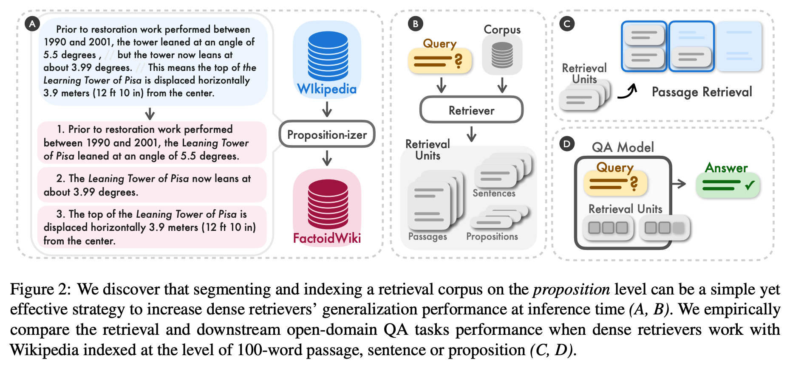

# Retrieval Augmented Generation Techniques in Llamaindex
 This repository collects multiple notebooks and .py files with techniques and solutions to RAG problems. Some simple solutions to more advanced ones to approach the retrieval, augmentation and generation of answers or information about data/documents provided.

 #### This repository is still in progress. 

 ### Dense X Retrieval

 Paper: ["Dense X Retrieval: What Retrieval Granularity Should We Use?"](https://arxiv.org/abs/2312.06648) by Tong Chen, Hongwei Wang, Sihao Chen, Wenhao Yu, Kaixin Ma, Xinran Zhao, Hongming Zhang, and Dong Yu from the University of Washington, Tencent AI Lab, University of Pennsylvania, and Carnegie Mellon University.

 Dense retrieval has emerged as a crucial method for obtaining relevant context or knowledge in open-domain NLP tasks. However, the choice of the retrieval unit, i.e., the pieces of text in which the corpus is indexed, such as a document, passage, or sentence, is often overlooked when a learned dense retriever is applied to a retrieval corpus at inference time. The researchers found that the choice of retrieval unit significantly influences the performance of both retrieval and downstream tasks.

 
 

It suggests that the choice of retrieval unit can significantly impact retrieval performance, highlighting the potential of propositions as a novel retrieval unit. This research contributes to the ongoing efforts to improve the performance of dense retrieval in open-domain NLP tasks and offers valuable insights for researchers and professionals in the field.

In summary, the authors introduce the Propositionizer as a text generation model fine-tuned through a two-step distillation process, involving the use of GPT-4 and Flan-T5-large. The approach combines the capabilities of pre-trained language models with task-specific fine-tuning, demonstrating a comprehensive strategy for parsing passages into propositions. The use of 1-shot demonstrations and distillation processes adds depth to the training methodology, showcasing a nuanced and effective approach in the realm of natural language processing.

In conclusion, the study underscores the potential of proposition-based retrieval as a superior approach, offering improved performance in both retrieval tasks and downstream QA applications. The compact yet context-rich nature of propositions appears to be a valuable asset in addressing the challenges posed by limited token length in language models

### Hybrid Search and Reciprocal Rerank Fusion 

A relatively old idea that you could take the best from both worlds — keyword-based old school search — sparse retrieval algorithms like tf-idf or search industry standard BM25 — and modern semantic or vector search and combine it in one retrieval result.
The only trick here is to properly combine the retrieved results with different similarity scores — this problem is usually solved with the help of the [Reciprocal Rank Fusion](https://plg.uwaterloo.ca/~gvcormac/cormacksigir09-rrf.pdf) algorithm, reranking the retrieved results for the final output.

The retrieved documents will be reranked according to the `Reciprocal Rerank Fusion` algorithm demonstrated in this [paper](https://plg.uwaterloo.ca/~gvcormac/cormacksigir09-rrf.pdf). It provides an effecient method for rerranking retrieval results without excessive computation or reliance on external models.

*"Inthe search for such a method we came up with Reciprocal Rank Fusion (RRF) to serve as a baseline. We found that RRF, when used to combine the results of IR methods (including learning to rank), almost invariably improved on the best of the combined results. We also found that RRF consistently equaled or bettered other methods we tried, including established metaranking standards Condorcet Fuse and CombMNZ"*

Hybrid or fusion search usually provides better retrieval results as two complementary search algorithms are combined, taking into account both semantic similarity and keyword matching between the query and the stored documents.

### Sub Query RetrieverEngine for RAG 
Query transformations are a family of techniques using an LLM as a reasoning engine to modify user input in order to improve retrieval quality.

In this notebook, we showcase how to use a sub question query engine to tackle the problem of answering a complex query using multiple data sources.
It first breaks down the complex query into sub questions for each relevant data source, then gather all the intermediate reponses and synthesizes a final response.

### Sentence Window Retrieval

In this technique, we use the `SentenceWindowNodeParser` to parse documents into single sentences per node. Each node also contains a “window” with the sentences on either side of the node sentence. During retrieval, the similarity search is done over ther sentences then before passing the retrieved sentences to the LLM, the single sentences are replaced with a window containing the surrounding sentences using the `MetadataReplacementNodePostProcessor`.

This is most useful for large documents/indexes, as it helps to retrieve more fine-grained details. By default, the sentence window is 5 sentences on either side of the original sentence.

In this case, chunk size settings are not used, in favor of following the window settings.

# Content

- dense-x-retrieval: a notebook with the code from Llamaindex to build a propositional retrieval designed in the paper: ["Dense X Retrieval: What Retrieval Granularity Should We Use?"](https://arxiv.org/abs/2312.06648) by Tong Chen, Hongwei Wang, Sihao Chen, Wenhao Yu, Kaixin Ma, Xinran Zhao, Hongming Zhang, and Dong Yu from the University of Washington, Tencent AI Lab, University of Pennsylvania, and Carnegie Mellon University. Llamaindex provides a LlamaPack to apply this technique. The original code in this [link](https://github.com/run-llama/llama-hub/tree/main/llama_hub/llama_packs/dense_x_retrieval)

- reciprocal-rerank-fusion: a notebook where we build a simple RAG chain using an Hybrid Fusion Retriever with multiple queries and the Reciprocal Rerank Fusion, based on the [paper](https://plg.uwaterloo.ca/~gvcormac/cormacksigir09-rrf.pdf). 

- multi-sub-queries-engine: in this notebook we show you how to use subqueries to improve RAG application.

- sentence-window-retrieval: a sample notebook applying the sentence window retrieval and a reranker in the query engine.

# License

Copyright 2023 Eduardo Muñoz

   Licensed under the Apache License, Version 2.0 (the "License");
   you may not use this file except in compliance with the License.
   You may obtain a copy of the License at

       http://www.apache.org/licenses/LICENSE-2.0

   Unless required by applicable law or agreed to in writing, software
   distributed under the License is distributed on an "AS IS" BASIS,
   WITHOUT WARRANTIES OR CONDITIONS OF ANY KIND, either express or implied.
   See the License for the specific language governing permissions and
   limitations under the License.
